# 🛒 Tiendita Inteligente IA - Smart Point of Sale (POS) & Real-Time Inventory

[](https://python.org)
[](https://onnxruntime.ai/)
[](https://opencv.org/)
[](https://supervision.roboflow.com/)
[](https://github.com/ultralytics/ultralytics)
[](https://colab.research.google.com/)
[](LICENSE.md)

Sistema autónomo de **Punto de Venta (POS) y Control de Inventario en Tiempo Real** impulsado por Visión por Computadora e Inteligencia Artificial. Diseñado para procesar y cobrar artículos minoristas de forma automática mediante reconocimiento visual continuo, seguimiento multi-objeto por identificador único (ByteTrack), validación de existencias en almacén y generación de comprobantes fiscales detallados.

> 📖 **Manual de Operación para el Cajero / Usuario:** Para consultar la guía de uso paso a paso, atajos de teclado, controles táctiles y calibración, consulta el [Manual de Usuario Completo (MANUAL_DE_USUARIO.md)](MANUAL_DE_USUARIO.md).

---

## 📸 Demostración Visual del Flujo de Operación (Workflow en Vivo)

El sistema opera mediante un ciclo completo de visión artificial, control estricto de existencias y cobro comercial:

### 1. Estación de Trabajo & Productos Reales del Catálogo
<p align="center">
  
  
  <br>
  <em>Izquierda: Estación de caja con laptop y webcam frontal. Derecha: Productos reales del catálogo colocados sobre el mostrador de escaneo.</em>
</p>

### 2. Escaneo Inteligente en Tiempo Real (Modo Ticket POS)
<p align="center">
  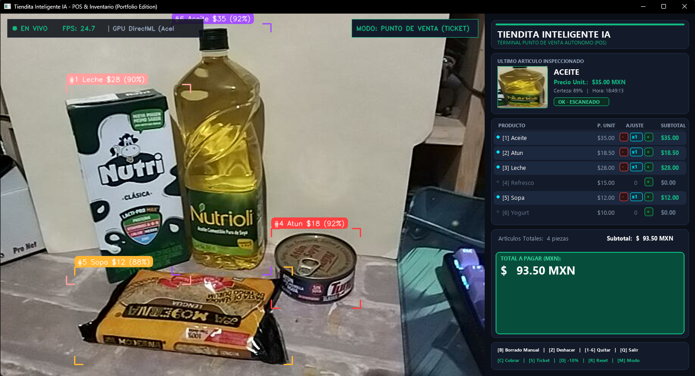
  <br>
  <em>Detección multi-objeto en vivo, esquinas tecnológicas de fijación, visor Picture-in-Picture (PiP) instantáneo, telemetría DirectML (~21 FPS) y carrito dinámico.</em>
</p>

### 3. Cancelación Manual y Auditoría de Inventario en Bodega
<p align="center">
  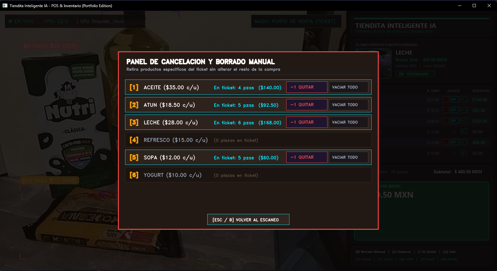
  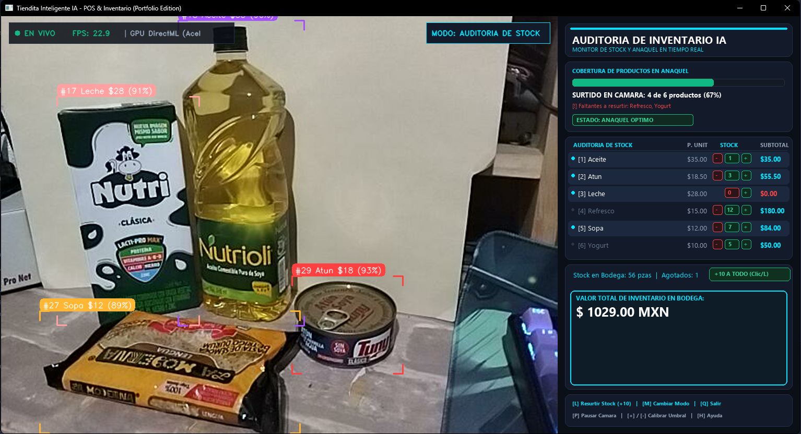
  <br>
  <em>Izquierda: Panel modal interactivo [B] para restar o vaciar artículos con protección anti-reescaneo. Derecha: Modo Inventario [M] con existencias en bodega, botones táctiles [-] / [+] y valor total de anaquel.</em>
</p>

### 4. Cobro Exitoso y Emisión de Recibo Fiscal Digital
<p align="center">
  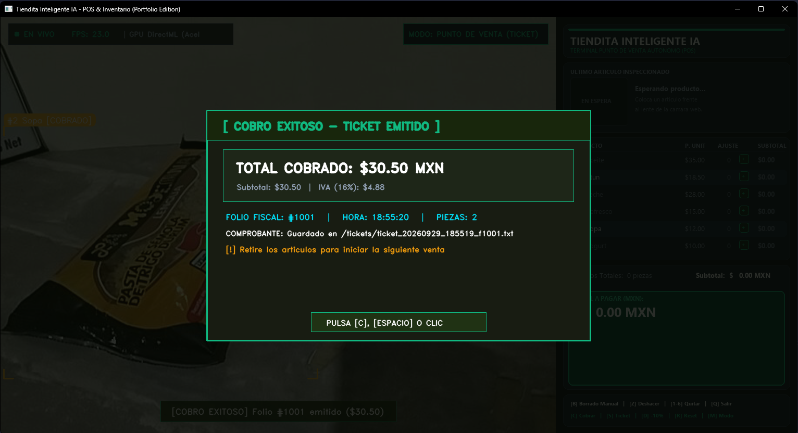
  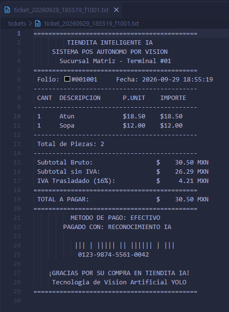
  <br>
  <em>Izquierda: Modal esmeralda tras presionar [C], vaciado automático del carrito y bloqueo anti-duplicados [COBRADO]. Derecha: Ticket digital generado con desglose de IVA y código de barras.</em>
</p>

---

## 🌟 Características Destacadas (Portfolio Highlights)

- ⚡ **Aceleración por Hardware (DirectML):** Inferencia en tiempo real sobre GPUs dedicadas e integradas (**AMD Radeon**, **Nvidia GeForce/RTX**, **Intel Iris/Arc**) alcanzando ~48 ms por fotograma (~21 FPS nativos en GPU AMD Radeon RX 6600M), con fallback automático a CPU.
- 🛡️ **Estándar Comercial Triple de Identificación:** Arquitectura de filtrado en cascada (Deep Learning a $\ge 80\%$ de certeza + Validación Geométrica de Producto + Confirmación Temporal ByteTrack de 3-4 cuadros) que erradica por completo falsos positivos en teclados, escritorios o sombras.
- 📦 **Control de Stock y Bloqueo por Falta de Existencias:** Gestión en tiempo real de bodega respaldada en `stock.json`. Si un producto tiene 0 piezas disponibles, la cámara lo etiqueta como `[SIN STOCK]`, emite una alerta acústica de error y bloquea su ingreso al carrito.
- 🖱️ **Gestión de Inventario Táctil e Interactiva:** En Modo Inventario (`[M]`), el usuario puede aumentar o disminuir el stock de bodega de cada producto con botones táctiles `[-]` / `[+]`, o presionar `[+10 A TODO]` (o tecla `[L]`) para resurtir masivamente.
- 🎯 **Seguimiento Multi-Objeto Continuo (ByteTrack):** Asignación de ID único por producto detectado en escena, previniendo duplicidad en el cobro o conteos erróneos ante oclusiones y movimientos rápidos.
- 🧮 **Post-Procesamiento 100% Vectorizado con Letterboxing:** Preparación de tensores preservando la relación de aspecto real sin distorsión vertical, cálculo de IoU y NMS enteramente en **NumPy**, eliminando cuellos de botella en bucles de Python.
- 🖼️ **Visor Picture-in-Picture (PiP) de Último Escaneo:** Extracción y renderizado en vivo del recorte de alta resolución del último producto identificado junto a su marca temporal, precio y métrica de certidumbre.
- 🎨 **Interfaz Glassmorphism Dark UI:** Diseño ergonómico de terminal comercial con esquema de color obsidian, tarjetas de métricas en tiempo real, indicador luminoso de presencia y HUD de telemetría de hardware (FPS, latencia y GPU activa).
- 📐 **Diseño Responsivo e Inteligente (Alta Definición):** Escalado bicúbico de cámara web, renderizado de texto anti-aliased con fuentes TrueType (Segoe UI), soporte nativo High-DPI en Windows y geometría adaptativa a cualquier monitor.
- 🪟 **Cierre Limpio y Pantalla Completa:** Manejo robusto de eventos de ventana (botón rojo `[X]` de Windows o teclas de atajo) y alternancia instantánea a pantalla completa (`[F]`) para quioscos comerciales.
- 🧱 **Arquitectura Modular Limpia (Clean Architecture):** Código desacoplado en subsistemas independientes (`config`, `engine`, `state`, `audio`, `receipts`, `ui/theme`, `ui/renderer`, `ui/layout`) con separación estricta de responsabilidades.
- 🧾 **Generador y Exportador de Tickets Digitales:** Emisión automática de comprobantes de compra en formato `.txt` con desglose de productos, cálculo dinámico de IVA (16%), descuentos promocionales y código de barras simulado.
- 🔊 **Feedback Auditivo Asíncrono:** Emisión de pitidos de escáner (*bip*), campanilla de caja registradora y tono grave de alerta de stock ejecutados en hilos secundarios desacoplados del flujo de video.
- 🔀 **Soporte Multimodal en Caliente:** Alternancia dinámica con la tecla `[M]` entre modo *Ticket de Cobro*, modo *Control de Inventario* y *Modo Completo*.

---

## 🏗️ Arquitectura del Software

El sistema sigue el principio de **Separación de Responsabilidades** estructurado en capas limpias y desacopladas:

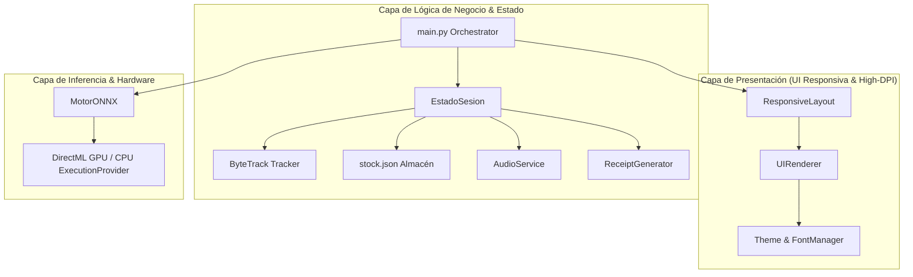

---

## 🛡️ Estándar Triple de Identificación de Grado Comercial

Para garantizar que ningún objeto del entorno (teclados, escritorios, tazas o sombras) sea confundido con un producto comercial, el sistema implementa una **estrategia de validación en 3 capas**:

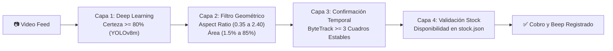

1. **Capa 1 (Inferencia de Alta Certeza):** Se rechaza cualquier activación con confianza menor al **80% (`CONF_UMBRAL = 0.80`)**.
2. **Capa 2 (Sanidad Geométrica y Antropométrica):** 
   * Se descartan objetos extremadamente delgados o anchos mediante relación de aspecto ($0.35 \le W/H \le 2.40$), haciendo físicamente imposible que un teclado (ratio $\approx 3.8$) sea admitido como atún o lata.
   * Se exige un tamaño mínimo del $1.5\%$ del área de visión, ignorando teclas sueltas, tornillos o monedas.
3. **Capa 3 (Filtro de Estabilidad Temporal):** El objeto debe ser rastreado de forma continua por ByteTrack durante **al menos 3 fotogramas consecutivos** ($\approx 0.15\text{ s}$), impidiendo que parpadeos momentáneos sean cobrados.
4. **Capa 4 (Validación de Stock en Bodega):** Si las existencias en `stock.json` son 0, el producto se etiqueta como `[SIN STOCK]`, se bloquea el registro y se notifica al usuario.

---

## 🛒 Catálogo Oficial de Productos y Precios

| Tecla Rápida | Icono | Producto | Categoría | Precio Oficial (MXN) | Stock Inicial Sugerido |
| :---: | :---: | :--- | :--- | :---: | :---: |
| **`[1]`** | 🛢️ | **Aceite** | Abarrotes / Cocina | **$35.00** | 6 pzas |
| **`[2]`** | 🐟 | **Atún** | Enlatados / Despensa | **$18.50** | 10 pzas |
| **`[3]`** | 🥛 | **Leche** | Lácteos / Bebidas | **$28.00** | 8 pzas |
| **`[4]`** | 🥤 | **Refresco** | Bebidas / Refrescos | **$15.00** | 12 pzas |
| **`[5]`** | 🍲 | **Sopa** | Pastas y Granos | **$12.00** | 15 pzas |
| **`[6]`** | 🍦 | **Yogurt** | Lácteos / Refrigerados | **$10.00** | 5 pzas |

---

## 🧠 Métricas y Gráficas Oficiales de Entrenamiento

El modelo YOLOv8m fue entrenado mediante **Transfer Learning** sobre aceleradores **NVIDIA Tesla T4** en Google Colab con aumento de datos avanzado (*Mosaic 1.0, Mixup 0.15, Cosine Learning Rate*), alcanzando un **mAP@50 del 97.1% (pico de 97.9%)**.

### 📈 Curvas de Aprendizaje (Loss y mAP)
Las funciones de pérdida (*Box Loss, Class Loss, DFL Loss*) mostraron una reducción monótona superior al **84%**, alcanzando convergencia estable sin signos de sobreajuste:

<p align="center">
  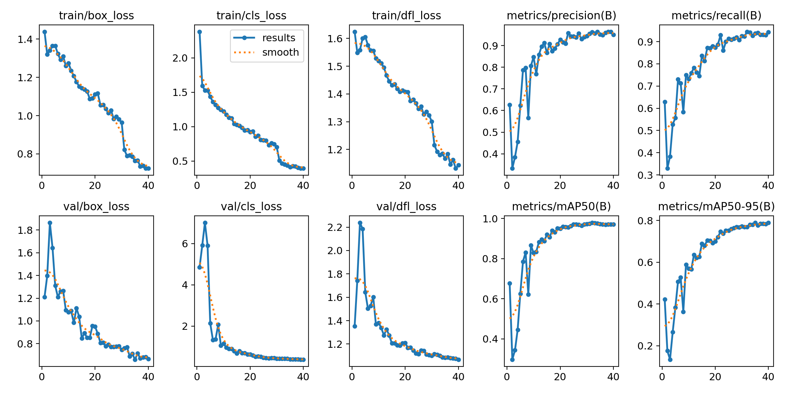
</p>

---

### 🎯 Matriz de Confusión y Curva Precision-Recall

<p align="center">
  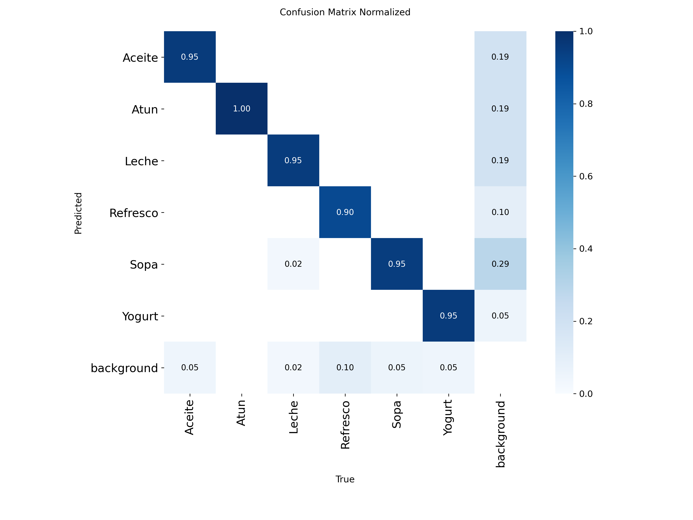
  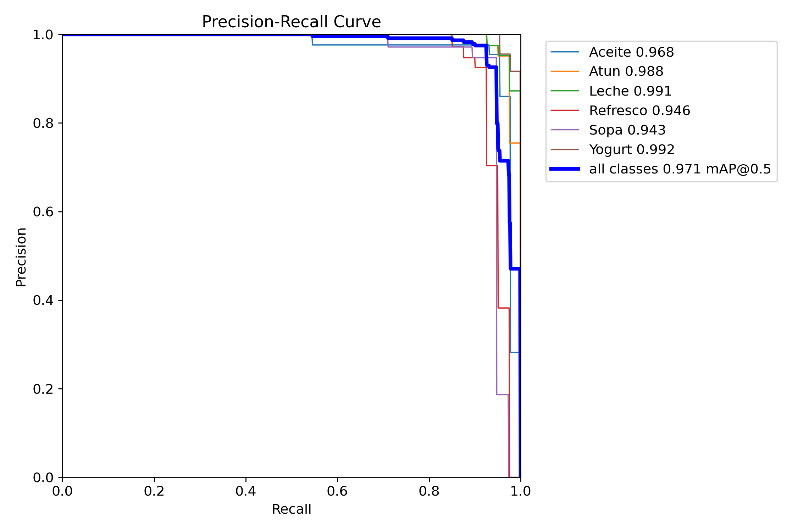
</p>

#### Resultados Oficiales por Producto:
* 🍦 **Yogurt:** **99.2% mAP** *(95% acierto directo en matriz)*
* 🥛 **Leche:** **99.1% mAP** *(95% acierto directo en matriz)*
* 🐟 **Atún:** **98.8% mAP** *(100% acierto perfecto en matriz)*
* 🛢️ **Aceite:** **96.8% mAP** *(95% acierto directo en matriz)*
* 🥤 **Refresco:** **94.6% mAP** *(90% acierto directo en matriz)*
* 🍲 **Sopa:** **94.3% mAP** *(95% acierto directo en matriz)*

---

### 🖼️ Inferencia Visual sobre Lote de Validación
Detecciones y predicciones con delimitación de cajas de alta resolución:

<p align="center">
  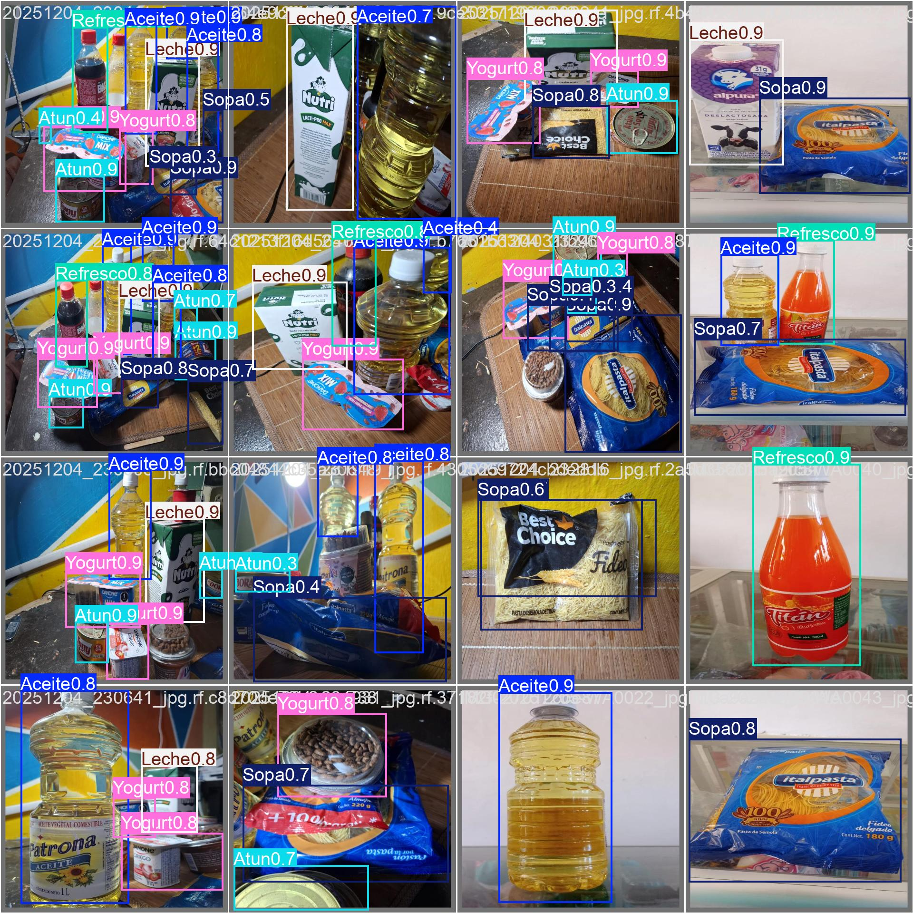
</p>

---

## ⌨️ Atajos de Teclado y Controles Interactivos

| Tecla / Control | Acción | Descripción |
| :---: | :--- | :--- |
| **`[B]`** | **Panel de Borrado Manual** | Abre un modal interactivo en pantalla para gestionar y retirar cualquier producto escaneado sin importar su orden en la compra. |
| **`[1]` al `[6]`** | **Quitar Producto Específico** | Resta 1 unidad directa del producto correspondiente a ese número (ej. `[5]` para quitar una Sopa escaneada hace varios artículos). |
| **Ratón: Clic `[-]` / `[+]`** | **Ajuste Táctil** | En Modo Ticket: suma o resta piezas al carrito. En Modo Inventario: suma o resta piezas al stock de bodega. |
| **Clic `[+10 A TODO]`** | **Resurtido Masivo** | Botón táctil en Modo Inventario para sumar +10 piezas a todos los productos del almacén. |
| **`[L]`** | **Resurtir Stock** | Tecla rápida para sumar +10 piezas a todos los productos en bodega (`stock.json`). |
| **`[Z]` / `[Backspace]`** | **Deshacer Último Escaneo** | Elimina del ticket el último producto detectado si se agregó por error inmediato. |
| **`[C]`** | **Cobrar Venta** | Finaliza la compra, descuenta del stock de bodega, emite ticket fiscal y resetea para nuevo cliente. |
| **`[S]`** | **Guardar Ticket** | Exporta el recibo fiscal actual a la carpeta `/tickets` en formato digital (.txt). |
| **`[D]`** | **Descuento 10%** | Activa o desactiva la promoción especial del 10% sobre el subtotal acumulado. |
| **`[M]`** | **Cambiar Modo** | Cicla entre modo *Ticket*, modo *Inventario* y *Modo Completo*. |
| **`[F]`** | **Fullscreen** | Alterna entre ventana redimensionable y modo pantalla completa (Kiosco). |
| **`[+]` / `[-]`** | **Calibrar Certeza** | Aumenta o disminuye en vivo el umbral de confianza (+/- 5%) para adaptarse a la luz ambiental. |
| **`[R]` / `[T]`** | **Reiniciar** | Reinicia la sesión, IDs de seguimiento e inventario de carrito a cero. |
| **`[P]`** | **Pausar** | Congela / reanuda temporalmente la captura y el análisis en vivo. |
| **`[H]` / `[ESPACIO]`** | **Ayuda** | Despliega el modal flotante con la arquitectura del sistema y lista de comandos. |
| **`[X]` / `[Q]` / `[ESC]`** | **Salir** | Cierra la ventana y libera recursos de hardware de forma limpia e instantánea. |

---

## 🚀 Instalación y Ejecución

### 1. Clonar el repositorio
```bash
git clone https://github.com/tu-usuario/tiendita-inteligente-ia.git
cd tiendita-inteligente-ia
```

### 2. Instalar dependencias
```bash
pip install opencv-python numpy supervision onnxruntime-directml pillow ultralytics onnx
```

> **Aceleración GPU en Windows:** El paquete `onnxruntime-directml` activa aceleración por hardware nativa sobre DirectX 12 en tarjetas AMD Radeon, Nvidia GeForce/RTX e Intel Iris/Arc.

### 3. Iniciar la aplicación
```bash
# Modo principal con auto-detección de aceleración:
python main.py

# O ejecutar directamente mediante los lanzadores de modo:
python FinalGPU.py    # Fuerza modo GPU DirectML
python FinalCPU.py    # Fuerza modo CPU
```

---

## 📁 Estructura Limpia del Proyecto

```text
Tiendita/
├── .gitignore                          # Exclusiones de control de versiones y logs
├── README.md                           # Documentación técnica completa de portafolio
├── MANUAL_DE_USUARIO.md                # Manual operativo para el usuario y cajero (Guía POS)
├── LICENSE.md                          # Términos de propiedad intelectual y licencias de terceros
├── stock.json                          # Base de datos local de existencias en almacén
├── main.py                             # Orquestador principal (UI Responsiva + POS)
├── FinalGPU.py                         # Lanzador rápido optimizado para GPU DirectML
├── FinalCPU.py                         # Lanzador rápido para entornos de solo CPU
├── train.py                            # Pipeline local de entrenamiento, importación y ONNX
├── Entrenamiento_Tiendita_YOLOv8.ipynb # Cuaderno de Google Colab para entrenamiento con GPU T4
├── dataset.zip                         # Dataset comprimido para carga inmediata a Google Drive
├── MiModelo_YOLO_BEST.onnx             # Modelo ONNX optimizado con DirectML (GPU AMD)
├── MiModelo_YOLO_BEST.pt               # Pesos PyTorch originales limpios de metadatos
├── tickets/                            # Comprobantes fiscales generados (.txt)
├── docs/                               # Activos de documentación, fotos y gráficas
│   ├── setup_hardware.jpg              # Foto física: Setup de trabajo con laptop y cámara
│   ├── productos_catalogo.jpg          # Foto física: Productos reales sobre el mostrador
│   ├── screenshot_pos.png              # Captura: Terminal POS escaneando en vivo
│   ├── screenshot_borrado.png          # Captura: Modal interactivo de borrado manual
│   ├── screenshot_ticket.png           # Captura: Notificación de cobro exitoso
│   ├── screenshot_inventario.png       # Captura: Modo de control de stock y almacén
│   ├── screenshot_recibo.png           # Captura: Ticket digital visualizado en Bloc de Notas
│   ├── metricas_entrenamiento.png      # Curvas de pérdida y mAP del entrenamiento
│   ├── matriz_confusion.png            # Matriz de confusión normalizada
│   ├── curva_precision_recall.png      # Curvas PR por clase
│   └── predicciones_validacion.jpg     # Muestras visuales de validación
└── src/                                # Código fuente modular (Clean Architecture)
    ├── config.py                       # Catálogo, precios y constantes geométricas
    ├── engine.py                       # Motor de inferencia ONNX con Letterbox
    ├── state.py                        # Máquina de estados reactiva de la sesión y stock
    ├── audio.py                        # Sonidos asíncronos desacoplados
    ├── receipts.py                     # Generador de recibos fiscales (.txt)
    └── ui/                             # Subsistema de interfaz visual responsiva
        ├── theme.py                    # Paleta de colores obsidian y FontManager High-DPI
        ├── renderer.py                 # Renderizado de widgets, PiP y modales
        └── layout.py                   # Composición y escalado de pantalla completa
```

---

## 👨‍💻 Autor & Portafolio
Desarrollado como proyecto de portafolio para demostrar habilidades avanzadas en:
- **Inteligencia Artificial Aplicada:** Detección de objetos, transfer learning, Data-Centric AI y fine-tuning.
- **Visión por Computadora de Alto Rendimiento:** Inferencia en tiempo real acelerada por GPU DirectML (~48ms / 21 FPS) con Letterboxing y tracking continuo (ByteTrack).
- **Arquitectura de Software Limpia:** Principios SOLID, modularidad desacoplada y diseño UI responsivo High-DPI.

---

## 🤖 Nota sobre el Uso de Inteligencia Artificial
> [!NOTE]
> **Transparencia y Metodología:**
> En este proyecto se utilizaron herramientas de **Inteligencia Artificial (IA)** como asistencia técnica para:
> - **Redacción y Estructuración de la Documentación:** Elaboración de la documentación técnica, guías de arquitectura de software y el manual de usuario paso a paso.
> - **Diseño de Interfaces de Usuario (UI/UX):** Refinamiento ergonómico de las pantallas de punto de venta (POS), esquema de colores obsidian, distribución espacial de telemetría y modales interactivos.

---

## 📄 Licencia & Propiedad Intelectual

**Copyright (c) 2026 Mayka — Todos los Derechos Reservados.**

* **Código de la Aplicación:** El diseño de la interfaz de usuario, la máquina de estados reactiva, la lógica de caja registradora, los módulos de audio y el generador de comprobantes son propiedad intelectual exclusiva de su autor. Se autoriza su consulta para fines académicos, educativos y de evaluación profesional en procesos de selección.
* **Componentes de Terceros y Código Abierto:** Este proyecto respeta íntegramente los términos y condiciones de las tecnologías utilizadas:
  * **OpenCV:** Licenciado bajo [Apache 2.0](https://www.apache.org/licenses/LICENSE-2.0).
  * **Microsoft ONNX Runtime:** Licenciado bajo [MIT License](https://github.com/microsoft/onnxruntime/blob/main/LICENSE).
  * **Roboflow Supervision:** Licenciado bajo [MIT License](https://github.com/roboflow/supervision/blob/main/LICENSE).
  * **NumPy:** Licenciado bajo [BSD 3-Clause License](https://numpy.org/doc/stable/license.html).
  * **Ultralytics YOLOv8:** Framework licenciado bajo [GNU AGPLv3](https://github.com/ultralytics/ultralytics/blob/main/LICENSE) / Licencia Comercial. En este proyecto la inferencia en tiempo real (`main.py`) opera desacoplada de la librería Ultralytics mediante ejecución nativa en **ONNX Runtime**.

Para más detalles sobre los términos de uso y compatibilidad de licencias, consulta el archivo [LICENSE.md](LICENSE.md).
